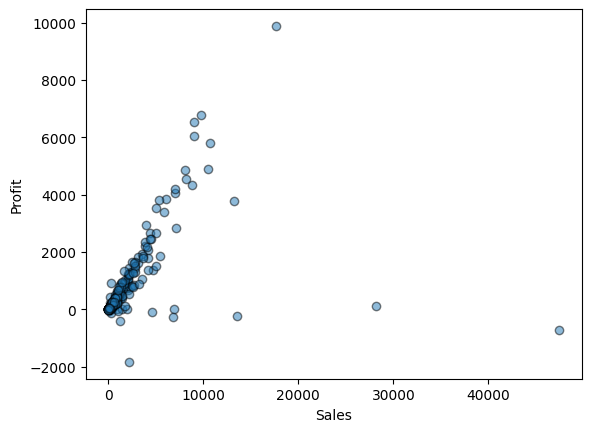
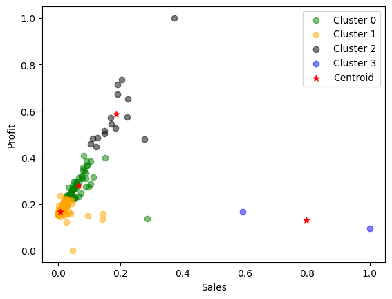

# DWKD-SPOZ

Data Warehouse and Knowledge Discovery (Skladiste Podataka i Otkrivanje Znanja)

Data folder contains many datasets.

## Table of Contents

- [Data Warehouse](#data-warehouse-sql-server-management-studio-19)
	- [Dimension Tables](#dimension-tables)
		- [Product Dimension](#dimproduct)
		- [Customer Dimension](#dimcustomer)
		- [Order Dimension](#dimorder)
		- [Location Dimension](#dimlocation)
		- [Sales Fact Table](#factsales)
	- [Fact Table](#fact-table-factsales)
- [Machine Learning](#machine-learning)
	- [K-Means algorithm](#k---means-algorithm)
		- [Elbow Method](#elbow-method)
	- [Clustering](#clustering)
# Data Warehouse (_SQL Server Management Studio 19_)

The following picture shows the data used in further work.

## Dimension tables

Dimensions are attributes that describe the characteristics of the data being analyzed. They provide context for measures and allow them to be compared based on different attributes.

Facts 

### DimProduct:

Create:
<pre>
CREATE TABLE DimProduct (
    Product_ID INT PRIMARY KEY IDENTITY(1,1),
    Product_Name NVARCHAR(100),
    Product_Department NVARCHAR(50),
    Product_Category NVARCHAR(50),
    Container NVARCHAR(50)
);
</pre>

Insert:
<pre>
INSERT INTO DimProduct(Product_Name, Product_Department, Product_Category, Container)
SELECT DISTINCT Product_Name, Product_Department, Product_Category, Container
FROM SuperstoreSales;
</pre>

### DimCustomer

Create:
<pre>
CREATE TABLE DimCustomer(
	Customer_ID smallint PRIMARY KEY IDENTITY(1,1),
	Customer_Name NVARCHAR(50),
	Customer_Segment NVARCHAR(50)
);
</pre>

Insert:
<pre>
INSERT INTO DimCustomer(Customer_ID, Customer_Name, Customer_Segment)
SELECT DISTINCT Customer_ID, Customer_Name, Customer_Segment
FROM SuperstoreSales;
</pre>

### DimOrder

Create:
<pre>
CREATE TABLE DimOrder(
	Order_Number INT PRIMARY KEY IDENTITY(1,1),
	Order_Priority NVARCHAR(50),
	Order_Date DATE,
	Ship_Date DATE,
	Ship_Mode NVARCHAR(50)
);
</pre>

Insert:
<pre>
INSERT INTO DimOrder (Order_Priority, Order_Date, Ship_Date, Ship_Mode)
SELECT DISTINCT Order_Priority, Order_Date, Ship_Date, Ship_Mode
FROM SuperstoreSales;
</pre>

### DimLocation

Create:
<pre>
CREATE TABLE DimLocation(
	Location_ID INT PRIMARY KEY IDENTITY(1,1),
	City NVARCHAR(50),
	Postal_Code int,
	State NVARCHAR(50),
	Country_Region NVARCHAR(50),
	Region NVARCHAR(50)
);
</pre>

Insert:
<pre>
INSERT INTO DimLocation(City, Postal_Code, State, Country_Region, Region)
SELECT DISTINCT City, Postal_Code, State, Country_Region, Region
FROM SuperstoreSales;
</pre>

## Fact table (_FactSales_)

Fact table contains all measures and transferred dimension keys (foreign keys). Measurements generally represent numerical data.

Create:
<pre>
CREATE TABLE FactSales(
	Sale_ID int IDENTITY(1, 1),
	Product_ID int,
	Order_Number int,
	Customer_ID smallint,
	Location_ID int,

	CONSTRAINT FK_DimProduct FOREIGN KEY (Product_ID) REFERENCES DimProduct(Product_ID),
	CONSTRAINT FK_DimOrder FOREIGN KEY (Order_Number) REFERENCES DimOrder(Order_Number),
	CONSTRAINT FK_DimCustomer FOREIGN KEY (Customer_ID) REFERENCES DimCustomer(Customer_ID),
	CONSTRAINT FK_DimLocation FOREIGN KEY (Location_ID) REFERENCES DimLocation(Location_ID),
	CONSTRAINT PK_FactSales PRIMARY KEY (Sale_ID, Product_ID, Order_Number, Customer_ID, Location_ID),

	Order_Priority_Price tinyint,
	Discount decimal(18, 3),
	Unit_Price smallint,
	Order_Quantity smallint,
	Shipping_Cost smallint,
	Product_Base_Margin decimal(18, 3)
);
</pre>

Insert:
<pre>
INSERT INTO FactSales (Customer_ID, Location_ID, Order_Number, Product_ID, Order_Priority_Price, Discount, Unit_Price, Order_Quantity, Shipping_Cost, Product_Base_Margin)
SELECT c.Customer_ID, l.Location_ID, o.Order_Number, p.Product_ID, s.Order_Priority_Price, s.Discount, s.Unit_Price, s.Order_Quantity, s.Shipping_Cost, s.Product_Base_Margin
FROM SuperstoreSales s, DimCustomer c, DimLocation l, DimOrder o, DimProduct p
WHERE s.Customer_Name = c.Customer_Name AND s.Customer_Segment = c.Customer_Segment AND
s.City = l.City AND s.Postal_Code = l.Postal_Code AND s.State = l.State AND s.Country_Region = l.Country_Region AND
s.Order_Priority = o.Order_Priority AND s.Order_Date = o.Order_Date AND s.Ship_Date = o.Ship_Date AND s.Ship_Mode = o.Ship_Mode AND
s.Product_Name = p.Product_Name AND s.Product_Department = p.Product_Department AND s.Product_Category = p.Product_Category AND s.Container = p.Container;
</pre>

### Star Schema

A star schema is used to represent a dimensional model and is one of the most commonly used data organization structures in data warehouses. 

## Machine Learning

The _scikit-learn_ Python library was used to build this model and the development environment is _Google Colab_.

### K - Means algorithm

This algorithm was used because it is the most useful and generally gives the best results.

_Profit_ and _Sales_ are used as the main variables of the K-Means algorithm. The goal is to discover different groups of clusters within this data.

The following image shows a visual graph of the ration between _Profit_ and _Sales_.

#### Elbow method

Before the actual clustering, it's necessary to determine the number of clusters in advance. This is made possible by the __elbow method__ which is a simple and visual technique used to determine the optimal number of clusters. 

From the previous image; 4 is the optimal number of clusters.

### Clustering

After defining the number of clusters (_centroids_) it is necessary to create an instance of the K-Means algorithm: 
`km = KMeans(n_clusters = 4)`

Next image refers to a visual representation of how the data is grouped based on the similarity between _Profit_ and _Sales_.

The whole process is available at: <a href="https://github.com/fajni/DWKD-SPOZ/blob/main/K_Means.ipynb">K_Means.ipynb</a>